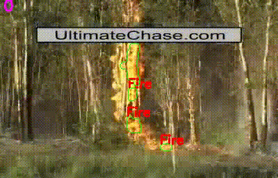
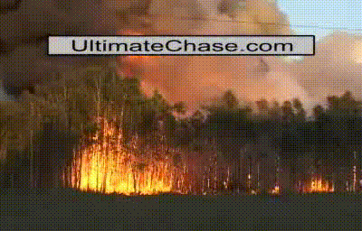
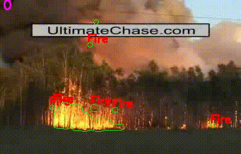
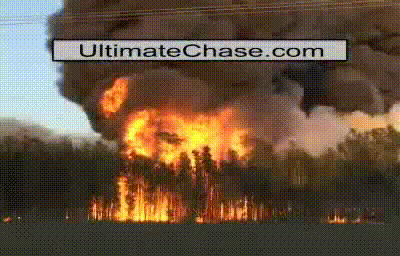

# Fire Segmentation Video Dataset
This Fire Segmentation Video Dataset was used on

**Real-Time Fire Detection Based on Color-Motion Feature for Video Surveillance System**\
Wahyono, Faisal Dharma Adhinata, Gamma Kosala, Agus Harjoko, Andi Dharmawan, and Kang Hyun Jo\
*(Under Review)*, 2021. 

This work was supported by the Ministry of Education Culture, Research and Technology, Republic of Indonesia under World Class Research (WCR) Grant 111/E4.1/AK.04.PT/2021 and 4506/UN1/DITLIT/DIT-LIT/PT/2021.  

## Overview
This dataset provides fire segmentation data on 12 common fire classification video. This dataset was obtained by per-frame, manual hand annotation with total of 2,684 annotated frames.

The original raw video data was obtained from [A. E. Çetin. “Computer Vision Based Fire Detection Dataset.” 2014](http://signal.ee.bilkent.edu.tr/VisiFire/Demo/FireClips). We provide seamless integration of the original data (**which are not included in this repository**) to ours, with [download_extract_dataset.py](./download_extract_dataset.py) script, that download, then extract the original dataset, and modified it to fit our environment settings. To open our annotation project files, we use [VIA (VGG Image Annotator)](https://www.robots.ox.ac.uk/~vgg/software/via/) version 2.0.11.

## Fire Segmentation Video Annotation Information Table

| Fire   Segmentation Video | Visifire Dataset          | FPS | Total Frame |
|---------------------------|---------------------------|-----|-------------|
| Video01                   | controlled1.avi           | 15  | 260         |
| Video02                   | controlled2.avi           | 15  | 246         |
| Video03                   | controlled3.avi           | 15  | 208         |
| Video04                   | forest1.avi               | 15  | 200         |
| Video05                   | forest2.avi               | 15  | 245         |
| Video06                   | forest3.avi               | 15  | 255         |
| Video07                   | forest4.avi               | 15  | 219         |
| Video08                   | forest5.avi               | 15  | 216         |
| Video09                   | fBackYardFire.avi | 2   | 241         |
| Video10                   | forestfire.avi            | 15  | 218         |
| Video11                   | fire1.avi         | 5   | 236         |
| Video12                   | 40m_PanFire_20060824.avi  | 29.97  | 140         |

## Usage Example
| VisiFire Video (A. E. Çetin, 2014) | Fire Segmentation Video Ground Truth      | Example Implementation (Wahyono et al., 2021) |
| ----------- | ----------- | ----------- |
|       |        |        |
|       |        |        |
|       |        |        |
|       |        |        |

## Requirements

- Tested on 64-bit Python 3.8
- Python Lib: PIL, OpenCV2, tqdm, numpy.

## Citations
If you use the following dataset please do not forget to cite the following:

>D. John et al. "Fire Segmentation Video Dataset for Video Surveillance System" DIB *(Under Review)*, 2021.
>
>A. E. Çetin. “Computer Vision Based Fire Detection Dataset.” 2014
